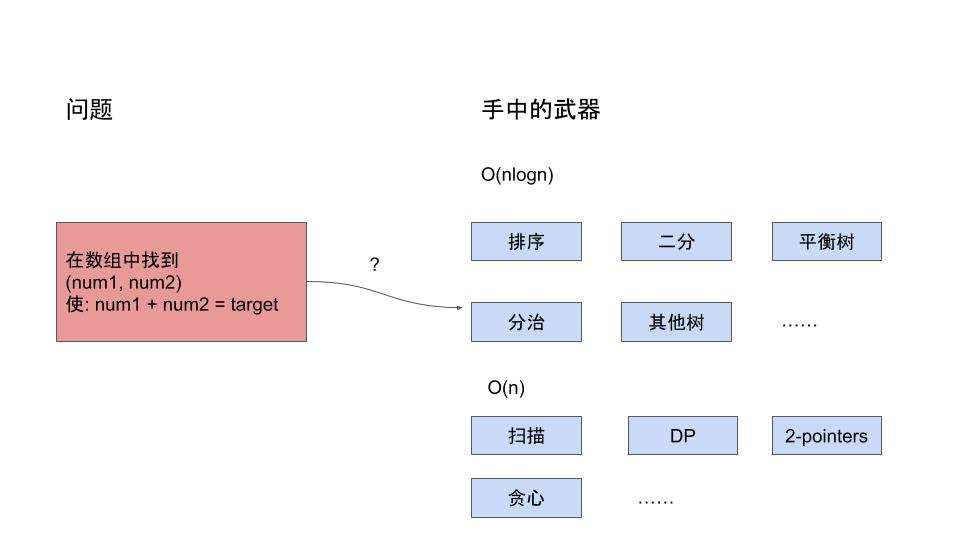
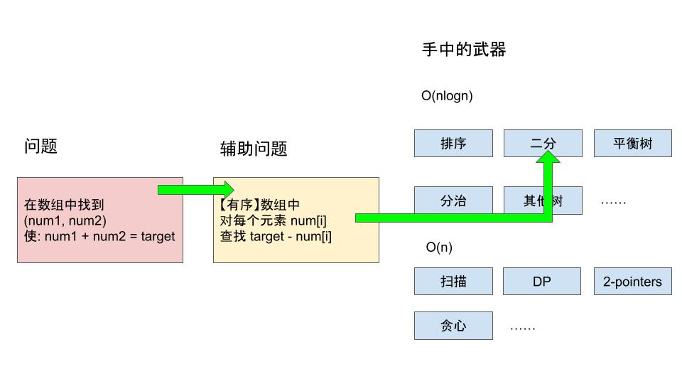
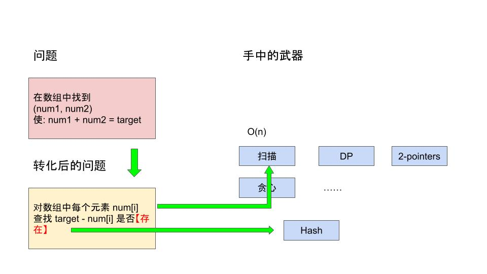
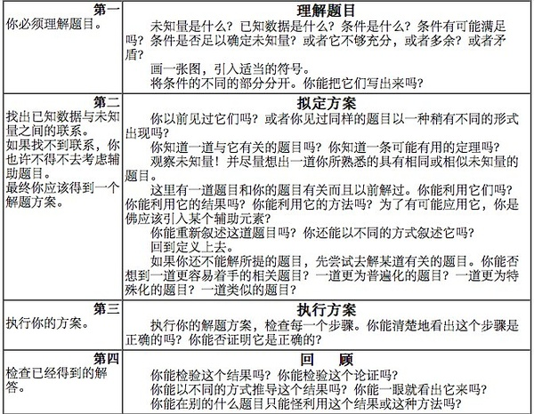

# [Two Sum](https://leetcode.com/problems/two-sum/)

## Solution in Python

```python
class Solution:
    def twoSum(self, nums: List[int], target: int) -> List[int]:
        last_seen = {}
        for i, num in enumerate(nums):
            maybe_j = last_seen.get(target - num)
            if maybe_j is not None:
                return [i, maybe_j]
            last_seen[num] = i
```

## 解题思路

### O(n^2) Brute-Force

显然有 O(n^2) 的两层循环枚举解法:

```python
class Solution:
    def twoSum(self, nums: List[int], target: int) -> List[int]:
        for i, num1 in enumerate(nums):
            for j, num2 in enumerate(nums):
                if i != j and num1 + num2 == target:
                    return [i, j]
```
但是这个暴力解法是不能AC的

### 了解你的武器

本系列教程假设读者掌握了一种编程语言，教科书范围的算法和数据结构。回顾一下常见的算法和数据结构及其复杂度：

1. 指数级，O(n!) ≈ O(2^n)，常见于生成排列，生成集合所有子集的枚举
2. 多项式级，O(n^4), O(n^3), O(n^2)，常见于多重循环枚举，动态规划和许多经典算法
3. O(n^1.5)，较为稀少，有机会细讲
4. O(nlogn)，这个复杂度常见于二分，排序，分治，以及树数据结构
5. O(n)，这个复杂度只能支持每个元素访问一遍或固定的几遍，比如 Hash，2-pointer，DP 等算法

优于 O(n) 的算法意味着算法不能遍历每个元素，需要输入数据有序或者证明大部分的输入和求解无关。

6. O(sqrt(n))，同 3，有机会细讲
7. O(log(n))，常见于二分
8. O(1)，常见于可证明结论（游戏必胜 or 必输，计数问题可找到通项公式）

### 怎样解题

著名数学家波利亚在怎样解题中说，解题就是找到已知和未知的关系。现在的状况是：

问题：在数组中找到 (num1, num2) 使: num1 + num2 = target。

已知：现在的解法为 O(n^2)，O(n) 的方法是下限，因为至少要知道每个数是什么，所以可选的武器在 O(nlogn) 和 O(n) 的范围



### 辅助问题：如果数组有序？

波利亚在怎样解题中说，如果对原问题没有想法，可以考虑寻找一个辅助问题。根据经验，对于可以交换顺序的输入，排序后往往有新发现。比如很多操作：求最大最小第K大，查询等在有序数组内可以高效执行。很多贪心算法也要先排序。因此我们尝试排序。

如果输入数组有序，那么会有以下这些方法：

1. Early break：在二重循环中先选定 num1，再枚举 num2，如果num1 + num2 > target 则可以 break。
Early break 有一定的优化作用，但效果赖于数据。可构造出：target = 10000, nums = [1, 9998, 3, 9996, 5, 9994..., 5000, 5000]. Worst case 仍然是 O(n^2)。

2. 二分法：选定 num1 之后因为整个数组有序，可以通过二分代替循环来得出最远能走到哪。问题转化为选定 num1，在有序的子数组里查找 target - num1。每次二分复杂度为 O(logn)，执行 n 次，总复杂度为O(nlogn)

3. 2-pointers，留到 2-pointers 专门的问题细说。

所以花费 O(nlogn) 排序后二分（O(nlogn)）或 2-pointers（O(n)）是可行的。我们找到了一个总复杂度为 O(nlogn) 的解法。



### 重新定义问题

我们从辅助问题中获得了启示，原问题可以转化为：对所有的 nums[i]，查找 target - nums[i] 是否存在。因此很容易想到哈希表。哈希表可以在 O(1) 的时间加入，删除，查询某个元素是否存在。因此问题解法的大方向就确定了。



## 细节实现

### 处理重复元素 6, [3, 3] => {0, 1}

按题意：`you may not use the same element twice.`，因此有两个处理方法：

方法1：动态维护 last_seen 保存 a[0...i - 1] 的坐标。对某个元素 nums[i], 在 last_seen 中查找，这样 last_seen 中包含的坐标都小于 i。然后将 (nums[i], i) 加入 last_seen 中，代码如开头题解。

方法2：对每个值只保存某次出现的下标。然后对每个 nums[i]，查找是否存在 nums[j] = target - num[i]，如果存在，且 i != j 则可以返回。

```python
class Solution:
    def twoSum(self, nums: List[int], target: int) -> List[int]:
        last_seen = {v:k for k, v in enumerate(nums)}
        for i, num in enumerate(nums):
            maybe_j = last_seen.get(target - num)
            if maybe_j and maybe_j != i:
                return [i, maybe_j]
```

### enumerate

```python
for i, num in enumerate(nums):
    # do something...
```

相当于：

```python
for i in range(len(nums)):
    num = nums[i];
    // do something...
```

用 enumerate 写出来更简单好看

## 其他语言实现
### C++
```cpp
class Solution {
public:
    vector<int> twoSum(vector<int>& nums, int target) {
        unordered_map<int, int> last_seen;
        for (int i = 0; i < nums.size(); i++) {
            int num = nums[i];
            const auto &it = last_seen.find(target - num);
            if (it != last_seen.end()) {
                return {it->second, i};
            }
            last_seen[num] = i;
        }
        return {};
    }
};
```

## 参考：怎样解题表

